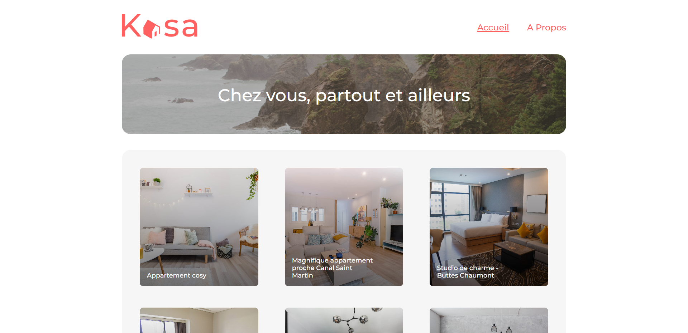

# Kasa
### OpenClassrooms P7 - Créez une application web de location immobilière avec React


**Kasa** est un des leaders de la location d’appartements entre particuliers en France. Pour une **refonte complète** de leur **plateforme web**, l'objectif est de **développer** la partie **front-end** de cette nouvelle application et ses différents **composants**, avec **React**, et les routes **React Router**, selon des maquettes **Figma** *responsives*.

## Contraintes techniques

### Outils

* Create React App
* React Router
* SASS *(optionnel)*

### React

* Découpage en composants modulaires et réutilisables
* Un composant par fichier
* Structure logique des différents fichiers
* Utilisation des *props* entre les composants
* Utilisation du *state* dans les composants quand c'est nécessaire
* Gestion des événements
* Listes : Utillisation des listes autant que possible, en itérrant dessus avec `map` par exemple
* Recommandation : utiliser des composants fonctionnels (plutôt que des composants classes)

### React Router

* Les paramètres des routes sont gérés par React Router dans l'URL pour récupérer les informations de chaque logement
* Il existe une page par route
* La page 404 est renvoyée pour chaque route inexistante, ou si une valeur présente dans l'URL ne fait pas partie des données renseignées
* La logique du routeur est réunie dans un seul fichier

### Lancer l'application Kasa

Pour une démonstration de l'application web, vous pouvez télécharger les fichiers, naviguer dans le répertoire `kasa`, et exécuter les commandes suivantes (si besoin, installer une version à jour de node.js pour les commandes `npm`) :
```console
npm install
npm start
```

